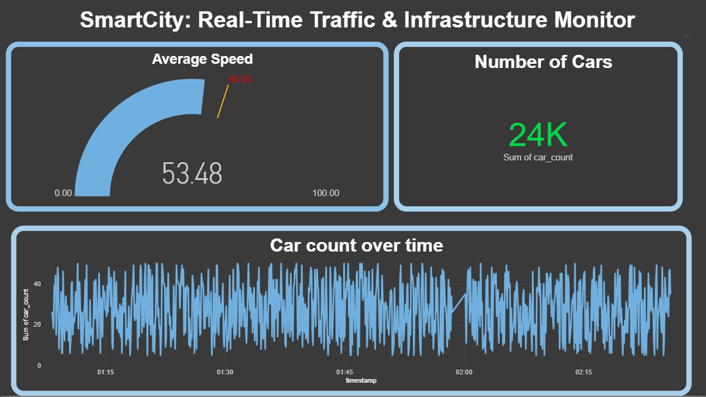

# 🚦 SmartCity: Real-Time Traffic Analytics Pipeline
An end-to-end Data Engineering project showcasing a live edge-to-cloud pipeline.

## 🏗️ Architecture
1. **Edge:** Python script simulating multiple IoT sensors (randomized speed/volume).
2. **Cloud:** Azure SQL Database (Serverless Tier) for data storage.
3. **Analytics:** Power BI Desktop using **DirectQuery** for sub-10s refresh latency.

## 🚀 Features
- **Live Stream:** Continuous data ingestion using `pyodbc`.
- **Logic-Driven Insights:** Automated "Speeding vs Normal" classification using DAX/Calculated Columns.
- **Interactive Dashboard:** Slicers for multi-sensor analysis and real-time gauge monitoring.

## 🛠️ Tech Stack
- **Python** (Libraries: `pyodbc`, `random`, `time`)
- **Microsoft Azure** (SQL Database)
- **Power BI** (DirectQuery mode)
- **SQL** (DDL for table schema)
  

.png)

